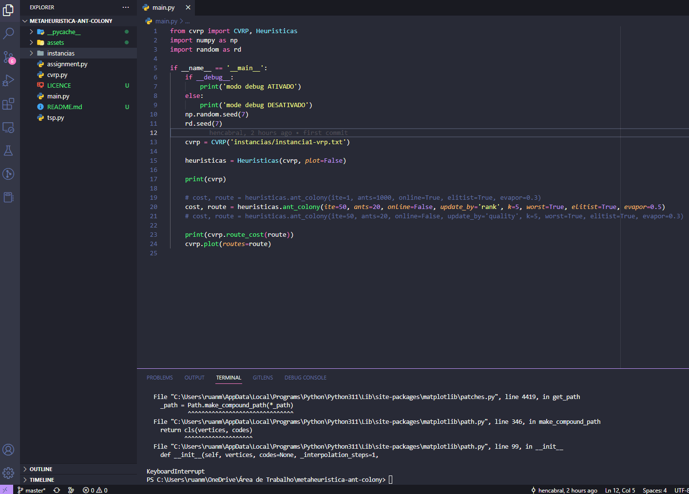

<!--  
  Ruan Pezzin Miniguite
  V. 3.0
-->


<!-- ============== HEADER ============== -->
<div align="center" id="header">

  

  ![GitHub repo size][GitHub repo size-shields]
  ![GitHub language count][GitHub language count-shields]
  ![GitHub forks][GitHub forks-shields]
  ![GitHub stars][GitHub stars-shields]
  [![GitHub License][GitHub License-shields]][GitHub License-link]
  
</div>

---

<!-- ===== INDEX ===== -->
<details>
  <summary>Index</summary>
  <ol>
    <li><a href="#about-the-project">About The Project</a></li>
    <li><a href="#language-and-tools">Language and tools</a></li>
    <li><a href="#installation">Installation</a></li>
    <li><a href="#license">License</a></li>
    <li><a href="#authors">Author</a></li>
  </ol>
</details>


<!-- ============== ABOUT ============== -->
## About the project

<div align="center">
  
  <a href="https://cachoeiro.ifes.edu.br/"></a>

</div>

<p>Colônia de formigas é uma metaheurística baseada em população e inspirada no comportamento forrageiro.</p


<!-- ============== LANGUAGE ============== -->
## Language and tools

```
> Python 3
```


<!-- ============== INSTALLATION ============== -->
## Installation

#### Git Clone
```
Git Clone https://github.com/RuanMiniguite/metaheuristica-ant-colony.git
```


<!-- ============== LICENSE ============== -->
## License

Copyright © 2023
This project is [MIT][GitHub License-link] licensed.


<!-- ============== AUTHOR ============== -->
## Authors

|[<br><sub>@LuizHenrique</sub>](https://github.com/hencabral)| [<br><sub>@NataliaPitanga</sub>](https://github.com/nataliap96)|[<br><sub>@PatriciaDaros</sub>](https://github.com/PatriciaDaros)|[<br><sub>@RuanMiniguite</sub>](https://github.com/RuanMiniguite)|
|:-|:-|:-|:-|

<p align="right">(<a href="#header">back to top</a>)</p>


<!-- ============== LINKs ============== -->
<!-- Alterar link -->
[Site-link]: https://github.com/RuanMiniguite/metaheuristica-ant-colony
[GitHub License-link]: https://github.com/RuanMiniguite/metaheuristica-ant-colony/blob/c3215c8c80a410c79ab8dd601eb07e6228aa159a/LICENCE

<!-- Alterar caminho para repositorio [Template-Readme] -->
[GitHub repo size-shields]: https://img.shields.io/github/repo-size/RuanMiniguite/metaheuristica-ant-colony?style=for-the-badge&color=292929
[GitHub language count-shields]: https://img.shields.io/github/languages/count/RuanMiniguite/metaheuristica-ant-colony?style=for-the-badge&color=292929
[GitHub forks-shields]: https://img.shields.io/github/forks/RuanMiniguite/metaheuristica-ant-colony?style=for-the-badge&color=292929
[GitHub stars-shields]: https://img.shields.io/github/stars/RuanMiniguite/metaheuristica-ant-colony?style=for-the-badge&color=292929

<!-- Permalink Shields-->
[GitHub License-shields]: https://img.shields.io/cocoapods/l/m?down_color=292929&up_color=292929&color=292929&style=for-the-badge
[Site-shields]: https://img.shields.io/badge/Site-Live-292929?style=for-the-badge&logo=web&logoColor=white
